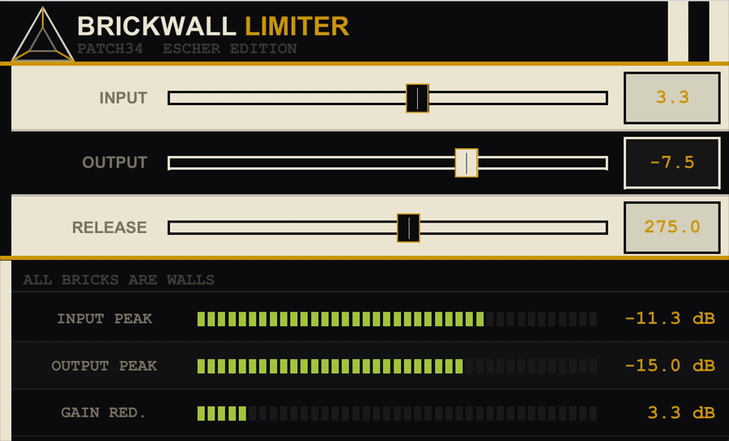

# Patch34: Brickwall Limiter

*Impossible Geometry Series: ESCHER*

  

Scripts and tools for REAPER. Useful, weird, and everything in between.

---

Sample-peak brickwall limiter with a custom Escher-inspired JSFX interface. Part of the Impossible Geometry Series.

## Installation

Copy `Patch34_Brickwall_Limiter.jsfx` to:

- macOS: `~/Library/Application Support/REAPER/Effects/`
- Windows: `%APPDATA%\REAPER\Effects\`

Then rescan JSFX in REAPER:
**Options → Preferences → Plug-ins → ReaScript / JS → Re-scan**

The plugin will appear as: `JS: Brickwall Limiter`

## Controls

| Parameter | Range | Description |
|-----------|-------|-------------|
| Input | −24..+24 dB | Input gain |
| Output Ceiling | −24..0 dBFS | Output ceiling |
| Release | 1..500 ms | Gain release time |

## License

MIT
